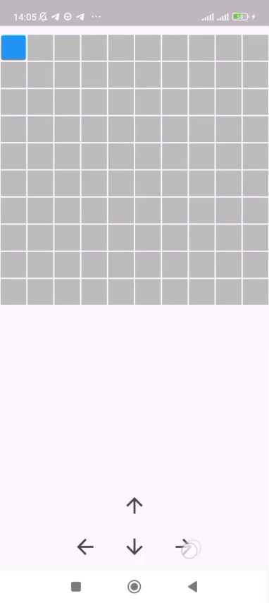

# Square Play

A simple starter Flutter project for experimenting with a small playable UI.  
This README provides quick setup, usage, and contribution notes — plus a demo GIF included from `assets/readme_files/play.gif`.

---

## Demo



> If the image doesn't render on GitHub, make sure the file exists at `assets/readme_files/play.gif` and has been committed to the repository.

---

## What is this repo?

**Square Play** is a minimal Flutter project created as a playground for UI/interaction ideas. It contains the basic Flutter folders and an initial `lib/` entry point. Use this repo as a starting point to build features, experiment with animations, or learn Flutter app structure.

---

## Features (example)

- Small, focused demo app
- Cross-platform template (Android / iOS / Web / Desktop)
- Demo GIF included for README

---

## Prerequisites

- Flutter (stable channel) installed and configured on your machine.  
- A connected device or emulator (Android emulator, iOS simulator, or a web browser).

---

## Getting started (local)

```bash
# clone the repo
git clone https://github.com/NanoLifeM/Square_Play.git
cd Square_Play

# fetch dependencies
flutter pub get

# run on web (Chrome)
flutter run -d chrome

# or run on an Android emulator
flutter emulators --launch <your-emulator-id>
flutter run -d emulator-5554

# build release APK (Android)
flutter build apk --release

# build for web
flutter build web
```

---

## Project structure (typical)

```
Square_Play/
├─ android/
├─ ios/
├─ lib/
│  └─ main.dart
├─ assets/
│  └─ readme_files/
│     └─ play.gif
├─ pubspec.yaml
└─ README.md
```

If `lib/` currently contains a single `main.dart`, consider splitting features into `lib/src/`, `lib/widgets/`, `lib/screens/` and `lib/models/` as the project grows.

---

## Recommended improvements (quick wins)

- Add a `LICENSE` (MIT or Apache 2.0 are common choices).
- Expand `README.md` with screenshots, architecture notes, and contribution guidelines.
- Add a GitHub Actions workflow for `flutter analyze` and `flutter test`.
- Add small unit/widget tests under `test/`.

---

## Contributing

1. Fork the repo
2. Create a feature branch: `git checkout -b feat/your-feature`
3. Commit your changes: `git commit -m "Add <feature>"`
4. Push and open a pull request

Please open issues for bugs or feature requests.

---

## License

No license is included in the repository yet. If you want others to freely use and contribute, consider adding a license file such as `LICENSE` with the MIT or Apache 2.0 license.

---

## Contact

You can reach me on Telegram: [@NanoLifeM](https://t.me/NanoLifeM)